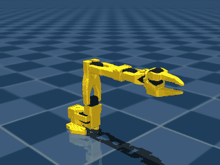
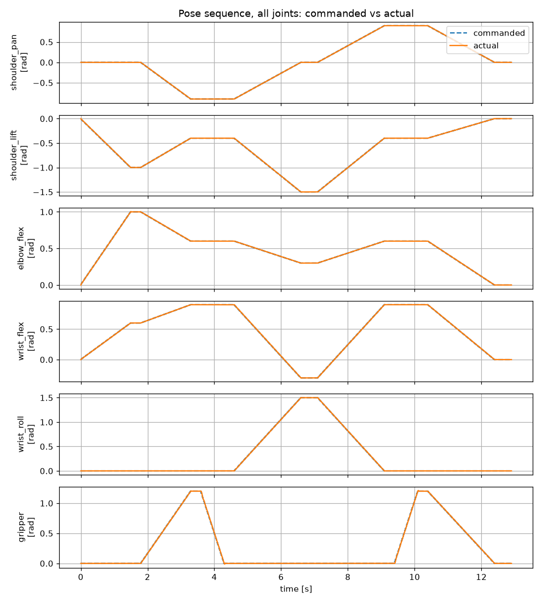

# Progress Log

A dated record of the project, newest first. Each entry covers one session or a span of sessions and lists, in plain terms:

- **Achieved**: concrete, verifiable outcomes, quantified where possible.
- **Formation**: the questions worked through, across the full stack the project rests on. That includes computing and operating systems, communication, electronics, mechanics, kinematics, control, measurement and statistics, perception, and machine learning.
- **Not achieved / open**: what didn't work, what is blocked, and what remains.

The project started from zero in most of these areas. The Formation lists record what was studied; they are not a claim of mastery. Entries are drafted with an AI-assisted workflow from private working notes, and each is reviewed by hand before it is committed.

---

### 2026-10-06 to 2026-10-07 · First simulations: single-joint dynamics and a 6-joint pose sequence

**Achieved**
- First hand-written simulation model: a one-joint pendulum stepped from Python (simulated swing period ≈ 1.2 s).
- SO-101 model inspected from Python: 8 bodies, 6 joints, 6 position actuators, 31 geometry elements.
- Simulated 0.5 rad step on one joint: overshoot to 0.627 rad, settled by ≈ 0.43 s, 0.0007 rad residual offset.
- Tracking error vs. move duration (0.5 rad move): largest gap 0.0047, 0.023, 0.33 rad at 2.0, 0.5, 0.1 s.
- First choreographed motion: all 6 joints through 7 poses, no floor contact, largest arm-joint gap 0.013 rad.
- Simulation only; motor parameters are borrowed from another robot model, so control error must come from the real arm.

**Formation — questions worked through**
- How is a robot described for a physics engine? (MJCF nested bodies, joints, geometry; visual vs. collision shapes; units)
- How is a simulation driven from Python? (compiled model vs. state, time stepping, actuator targets, live viewer)
- How are revolute-joint sign conventions defined unambiguously? (joint axis, right-hand rule, parallel axes forming a planar sub-chain)
- Which physical effects make up a simulated servo joint, and what does each contribute? (gravity load, link inertia, reflected rotor inertia J·N², feedback "spring", damping, torque limit)
- Why does a position-controlled joint overshoot when its torque saturates? (proportional feedback, bang-bang behaviour, momentum carrying past the target)
- How does interpolating joint targets trade motion speed against tracking error? (linear interpolation, 50 Hz targets on 500 Hz physics)
- Why should interpolation track progress through the move rather than add a constant increment? (α as fraction completed 0→1, accumulated rounding, real-clock timing)
- How is a multi-joint simulation recorded and analysed in Python? (per-step arrays stacked into a time × joint table, view vs. copy, column slicing, stacked plots)
- How are simulation frames rendered offscreen and compressed for documentation? (fixed camera, GIF export, cropping, frame skipping, palette reduction)

**Not achieved / open**
- No hardware progress: follower not assembled, leader IDs still unverified.
- Forward kinematics not started.

---

### 2026-09-25 to 2026-09-26 · Leader-arm configuration and preparation of the simulation track

**Achieved**
- Leader arm: 6/6 servos matched to joints by gear ratio, checked against the official bill of materials.
- Leader IDs 1–6 assigned with the single working board; not yet confirmed by a bus scan.
- Earlier "leader blocked" status corrected: ID assignment needs one board; two are needed only for teleoperation.
- Public SO-101 simulation model loaded in MuJoCo 3.14 in a test environment; joint names and order match LeRobot.
- Tip shift per encoder step (0.088°) computed from the model: 0.25–0.54 mm, depending on joint and pose.
- Stock gripper collision shapes found unable to hold a cube in simulation.

**Formation — questions worked through**
- On a shared servo bus, which operations need one adapter, and which need two at once? (daisy-chain addressing, ID assignment vs. teleoperation)
- How do supply voltage and gear reduction set a servo's torque and backdrivability? (three leader gear ratios, 5 V supply on 7.4 V-rated motors)
- How does joint encoder resolution translate into end-effector position error, and why does it depend on pose? (arc length, Jacobian)
- Why are forward kinematics and the Jacobian a prerequisite for an error budget, ahead of inverse kinematics?
- How should simulation, programming, kinematics and physical assembly be sequenced? (combining physical and virtual laboratories)
- How can control logic be shared between a simulated and a physical arm? (adapter layer, radians vs. degrees, simulated vs. real time)
- What happens when a command line runs a Python module? (shell search path, interpreter flags, argument passing, conda environments)
- Through which software layers does one servo command travel? (Python packet builder, serial library, kernel driver, board and servo firmware)

**References for the exercises**
- Backbone: Georgia Tech ECE 4560 (Maegan Tucker), a course built on the SO-101; used as a reference, not followed step by step.
- Deliberate differences: simulation first, forward kinematics and sensitivity before inverse kinematics, prediction vs. measurement in every exercise.
- Supplements: MIT 6.4210 *Robotic Manipulation*, Chapter 3; Northwestern *Modern Robotics* (Lynch & Park).
- Simulation model: TheRobotStudio's public SO-101 MuJoCo model (SO-ARM100 repository).
- Learning-design evidence: de Jong, Linn & Zacharia (2013), *Science*, on combining physical and virtual laboratories.

**Not achieved / open**
- Leader IDs not verified; a second driver board is still needed to run both arms together.
- Physical assembly not started; deliberately deferred to avoid reassembly and recalibration.

---

### 2026-09-23 to 2026-09-25 · Public repository, version control and documentation workflow

**Achieved**
- Public repository created with a documented structure: overview, progress log, and a README per folder.
- Private working notes and tool configuration excluded from version control; exclusion verified before publishing.
- Public objectives document written, including a researched overview of the current physical-AI landscape.
- AI coding agent installed and configured with project instructions and an approval-gated routine for this log.

**Formation — questions worked through**
- How does a Unix shell locate executables, and when do startup-file changes take effect? (search path, symbolic links, per-shell startup files)
- How does version control model a project's history? (working directory, staging area, commits)
- What distinguishes a local repository from a hosted remote?
- Why does untracking a file not remove it from history, and what can ignore rules not do?
- How are public engineering repositories conventionally structured? (reference layouts, per-folder documentation, changelog conventions)
- How does an AI coding agent act on a filesystem, and how is its authority bounded? (permission gating, standing instructions, skills)

**Not achieved / open**
- An early repository version included private notes in its history; the repository was rebuilt with a clean history.
- The routine for drafting this log needed several redesigns before the first entry.
- No hardware progress: leader arm still blocked; assembly not started.
- Repository license not yet chosen.

---

### 2026-09-19 to 2026-09-23 · Hardware bring-up: servo configuration and the communication layer

**Achieved**
- Follower arm: 6/6 servos assigned unique bus IDs, configured one servo at a time.
- Defective driver board isolated by substitution: 1 of 2 boards powered and enumerated but relayed no data.
- Warranty claim filed for the defective board; a low-cost backup adapter identified.
- Serial-port access configured persistently through group membership.

**Formation — questions worked through**
- How is a robotic manipulator decomposed into functional layers, and how do these map onto the error budget?
- How do joint angles determine end-effector position? (forward kinematics, at the intuition level)
- How is information physically transmitted between a computer and a peripheral? (UART bit timing, baud rate, USB differential signalling)
- How does a motor command become bytes on a shared servo bus? (packet structure, device IDs, registers, checksum)
- How does the Linux kernel expose a hardware device to user programs? (character devices, major/minor numbers, udev)
- How does a Unix shell resolve variables, programs and access rights? (environment variables, search path, permissions, groups)

**Not achieved / open**
- Leader arm not configured; blocked on a second working driver board.
- A hand-written diagnostic script briefly mimicked a hardware fault; the cause was a silently caught software error.
- Physical assembly and calibration not started.

---

### 2026-09-12 · Project planning and development environment setup

**Achieved**
- Semester time budget estimated against course load; single-semester completion kept as a stretch goal.
- Working method set: concepts built one at a time from physical intuition, alongside hands-on work.
- Camera setup revised to two cameras (wrist-mounted and overview); hardware kit sourced.
- Ubuntu 24.04 LTS installed as dual-boot, with NVIDIA GPU drivers for later policy training.
- LeRobot installed with Feetech servo support in a dedicated Python 3.12 environment; import verified.
- Development tooling installed: version control, code editor, Python package manager.

**Formation — questions worked through**
- Where does the boundary between hardware and software lie? (transistors as switches, bits, memory from feedback latches)
- How does a processor execute a stored program? (instruction sets, assembly, fetch–execute cycle)
- What is an operating system kernel, and what role do device drivers play?
- How do programs communicate with peripherals? (device protocols such as Modbus, memory-mapped I/O)
- Why is Linux the prevailing platform for robotics development? (ecosystem, real-time kernel extensions, file-based device access)
- How are Python dependencies isolated per project? (conda environments, interpreter version requirements)

**Not achieved / open**
- First LeRobot install failed: third-party guides specify Python 3.10, while current LeRobot requires 3.12 or newer.
- Measurement method (camera fiducials vs. mechanical fixture) not yet evaluated.
- Task geometry and policy choice not yet fixed.
